# EasyCaffe  
## User Manual  

## Contents

1. [Introduction](#introduction)  
2. [Portal Home Page](#portal-home-page)  
3. [User Login](#user-login)  
   3.1 [New User Registration](#new-user-registration)  
4. [Logged-in User Privileges](#logged-in-user-privileges)  
5. [Admin Privileges](#admin-privileges)  

---

## Introduction

The primary goal of the portal is to facilitate cafe managers in managing the café, orders, and menu, while making it easier for users to order food and reserve seats in the café.

---

## Portal Home Page

The portal home page looks as shown below:

- Menu display with filtering by ingredient type
- Seat reservation section
- Reviews display
- Café location display

---

## User Login

There are two cases of logging into the system:

- When a new user logs in for the first time and submits a registration request.
- When an existing user logs in to perform authorized actions.

If a user is not logged in, they can only order food and leave comments. Every visitor can view the menu and some ratings related to the café. Unauthenticated users can add items to the cart, but upon clicking the order button, they are prompted to register.

---

### New User Registration

1. Clicking the **Register** button opens the form for entering new user data.  
2. The registration page requires the user to fill in mandatory fields to proceed.

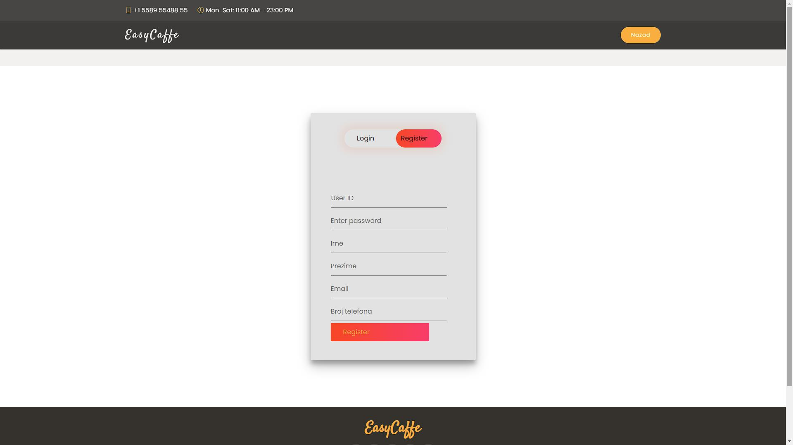

---

### Existing User Login

The login page requires email and password fields for user identification.  
For admin login, the email is `admin@easycaffe.com`, and the password is set upon the first admin registration.

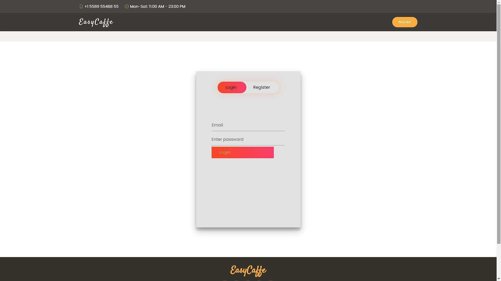

---

## Logged-in User Privileges

1. User logs into the system.  
2. The logged-in user can add comments and order food added to the cart.

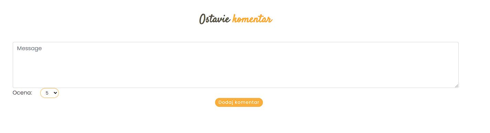

3. By filling the form and clicking **Add Comment**, the comment is saved in the database.  
4. Clicking the cart button opens the order cart.

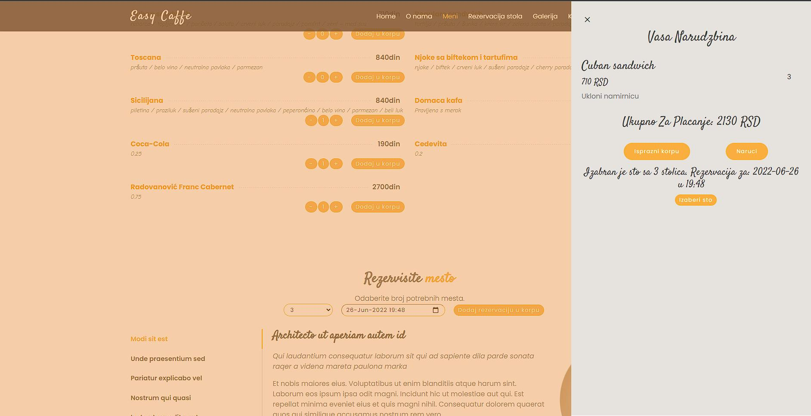

5. Users can select ingredient quantities using the “+” and “-” buttons and add them to the cart by clicking **Add to Cart**.

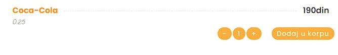

6. Clicking the **Choose Table** button in the cart view redirects the user to the table selection page, where they choose either take-away or a table with a specified number of seats. Selecting date and time for pickup or table release is mandatory.

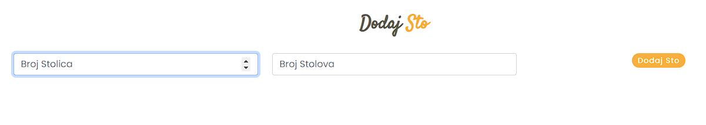

7. Clicking **Order** sends the order to the admin.

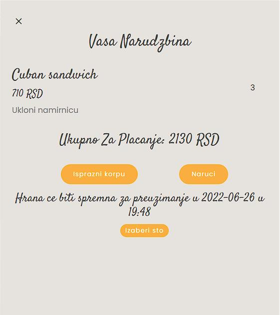

---

## Admin Privileges

The admin page’s first section is reserved for adding new ingredients to the menu, with proper restrictions enforced.

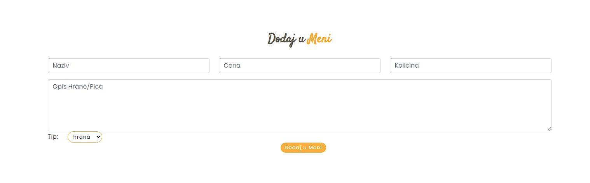

Next is the form to modify ingredient quantities, selected from a dropdown list sorted in descending order, with restrictions enforced.

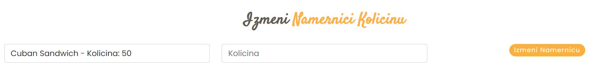

There is also an option to modify ingredient prices.

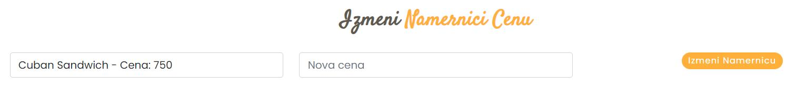

Admins can change ingredient names.

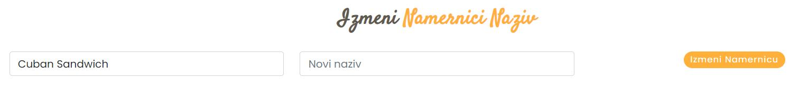

Ingredients can be deleted from the menu if necessary.

Adding new tables with the number of seats and quantity of such tables is also possible, respecting restrictions.

Reviews are displayed where admins can delete them. Reviews are sorted by date and shown 5 per page.

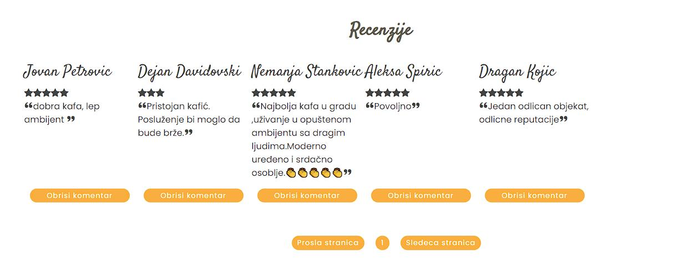

At the bottom of the page, orders are listed in a descending order dropdown.

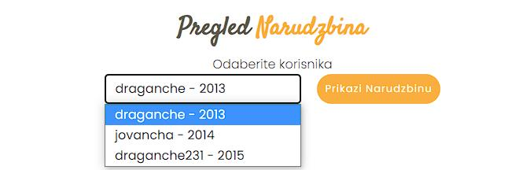

Selecting an ingredient shows details similar to the following.

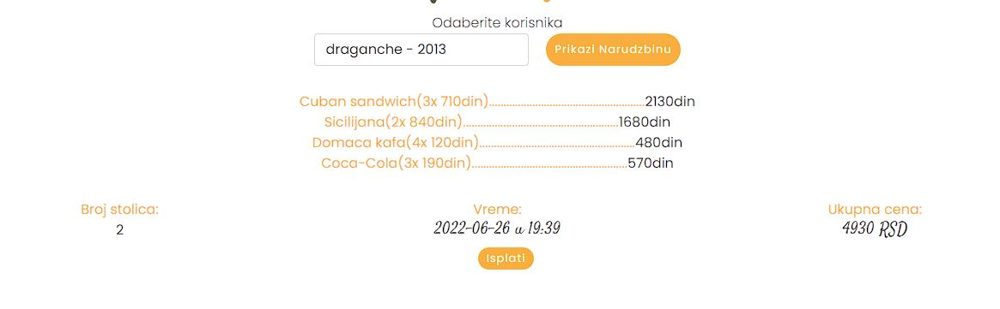
